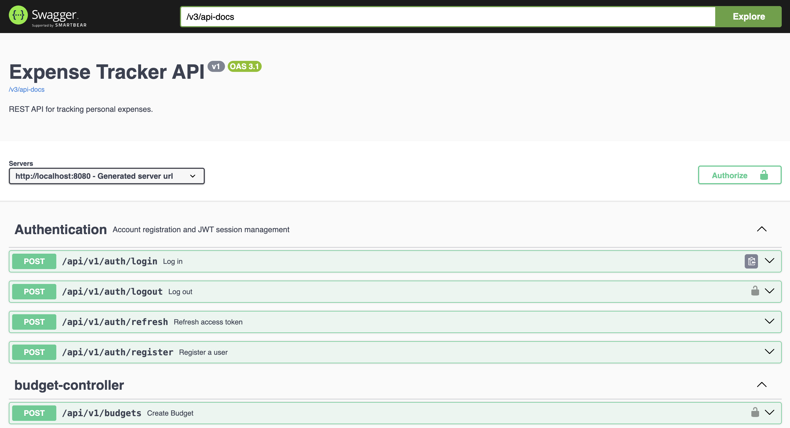

# 💰 Expense Tracker API


## 📌 Overview

Expense Tracker API is a backend application developed using **Spring Boot** that enables users to securely manage their personal finances through RESTful APIs.

The application includes secure authentication, income and expense management, budgeting, category management, reporting, and API documentation. It is designed using a clean layered architecture and follows modern backend development practices.

> **Note:** This repository currently contains the backend implementation. A React frontend is planned for a future release.


## ⭐ Project Highlights

- 🔐 Secure JWT Authentication & Authorization
- ⚡ RESTful API built with Spring Boot 3.5
- 🗄️ MySQL database with Flyway migrations
- 📖 Interactive API documentation using Swagger/OpenAPI
- 🛡️ Spring Security for protected endpoints
- 📊 Budget, Expense, Income & Report modules
- 📦 Clean layered architecture (Controller → Service → Repository)
- ☕ Built with Java 21 and Maven

---

# 🚀 Features
## 📋 Features Overview

| Module | Status |
|----------|--------|
| 🔐 JWT Authentication | ✅ Complete |
| 👤 User Management | ✅ Complete |
| 💸 Expense Management | ✅ Complete |
| 💰 Income Management | ✅ Complete |
| 🏷 Category Management | ✅ Complete |
| 📊 Budget Management | ✅ Complete |
| 📈 Reports | ✅ Complete |
| 📄 CSV Export | ✅ Complete |
| 📑 PDF Export | ✅ Complete |
| 📚 Swagger Documentation | ✅ Complete |
| 🛡 Spring Security | ✅ Complete |
| 🗄 MySQL Integration | ✅ Complete |
| 🚧 React Frontend | Planned |
| 🚀 Cloud Deployment | Planned |

## 🔐 Authentication

- User Registration
- Secure Login
- JWT Authentication
- Refresh Token
- Logout
- Password Encryption

---

## 💸 Expense Management

- Add Expense
- Update Expense
- Delete Expense
- View Expenses
- Pagination
- Search
- Filters
- Category Support

---

## 💰 Income Management

- Add Income
- Update Income
- Delete Income
- View Income

---

## 📊 Dashboard

- Current Balance
- Total Income
- Total Expense
- Monthly Summary
- Budget Overview

---

## 📈 Reports

- Financial Summary
- CSV Export
- PDF Export

---

## 🗂 Category Management

- Create Categories
- Update Categories
- Delete Categories
- Safe Delete Validation

---

## 🛡 Security

- Spring Security
- JWT Authentication
- Protected APIs
- Password Encryption
- User-specific Data Isolation

---

# 🛠 Tech Stack

| Category | Technologies |
|----------|--------------|
| **Language** | Java 21 |
| **Framework** | Spring Boot 3.5 |
| **Security** | Spring Security, JWT |
| **Database** | MySQL |
| **ORM** | Hibernate, Spring Data JPA |
| **Database Migration** | Flyway |
| **API Documentation** | Swagger / OpenAPI |
| **Build Tool** | Maven |
| **Version Control** | Git & GitHub |
---

# 📷 Screenshots

### Swagger API



---

# 🏗 Project Architecture

```
Client (React / Mobile / Swagger)

↓

Spring Boot REST API

↓

Controllers

↓

Services

↓

Repositories

↓

MySQL Database
```

---

# 🏗️ System Architecture

```text
                Client
      (Swagger / React Frontend)

                    │
                    ▼

         Spring Boot REST API

                    │
                    ▼

             Controller Layer

                    │
                    ▼

              Service Layer

                    │
                    ▼

           Repository Layer

                    │
                    ▼

             MySQL Database
```

### Request Flow

```
Client
   ↓
REST API
   ↓
Controller
   ↓
Service
   ↓
Repository
   ↓
MySQL
```

---

# 📡 API Documentation

The Expense Tracker API uses **Swagger (OpenAPI 3)** for interactive documentation.

After starting the application locally, open:

```text
http://localhost:8080/swagger-ui/index.html
```

The OpenAPI specification is available at:

```text
http://localhost:8080/v3/api-docs
```

## 📋 API Endpoints

### Authentication

| Method | Endpoint | Description |
|---------|----------|-------------|
| POST | `/api/v1/auth/register` | Register a new user |
| POST | `/api/v1/auth/login` | Login and receive JWT token |
| POST | `/api/v1/auth/refresh` | Refresh access token |
| POST | `/api/v1/auth/logout` | Logout current user |

### Expenses

| Method | Endpoint | Description |
|---------|----------|-------------|
| GET | `/api/v1/expenses` | Get all expenses |
| POST | `/api/v1/expenses` | Create a new expense |
| PUT | `/api/v1/expenses/{id}` | Update an expense |
| DELETE | `/api/v1/expenses/{id}` | Delete an expense |

### Categories

| Method | Endpoint | Description |
|---------|----------|-------------|
| GET | `/api/v1/categories` | Get all categories |
| POST | `/api/v1/categories` | Create a category |
| PUT | `/api/v1/categories/{id}` | Update a category |
| DELETE | `/api/v1/categories/{id}` | Delete a category |

### Income

| Method | Endpoint | Description |
|---------|----------|-------------|
| GET | `/api/v1/incomes` | Get all income |
| POST | `/api/v1/incomes` | Add income |
| PUT | `/api/v1/incomes/{id}` | Update income |
| DELETE | `/api/v1/incomes/{id}` | Delete income |

---


# ⚙️ Installation

### 1. Clone the repository

```bash
git clone https://github.com/namandeeptripathi/Expense-Tracker.git
```

### 2. Navigate to the project

```bash
cd Expense-Tracker
```

### 3. Configure MySQL

Create a MySQL database named:

```text
expense_tracker
```

Update the database credentials in `application.yml` (or set the required environment variables).

### 4. Run the application

```bash
mvn spring-boot:run
```

### 5. Open Swagger UI

After the application starts successfully, open:

```text
http://localhost:8080/swagger-ui/index.html
```

---

# 📂 Project Structure

```text
Expense-Tracker
│
├── src
│   ├── main
│   │   ├── java
│   │   │   └── com.namandeep.expensetracker
│   │   │       ├── config
│   │   │       ├── controller
│   │   │       ├── dto
│   │   │       ├── entity
│   │   │       ├── exception
│   │   │       ├── repository
│   │   │       ├── security
│   │   │       ├── service
│   │   │       ├── util
│   │   │       └── ExpenseTrackerApplication.java
│   │   └── resources
│   │
│   └── test
│
├── screenshots
├── README.md
├── LICENSE
├── pom.xml
└── .gitignore

# 🗄 Database Design

The database follows a relational design using **MySQL**.

The Entity Relationship Diagram (ERD) is available here:

➡️ **[View ER Diagram](assets/ER-Diagram.md)**
```
```

---

# 📚 Key Learning Outcomes

Building this project helped me gain practical experience in:

- REST API Development using Spring Boot
- Layered Architecture (Controller → Service → Repository)
- JWT Authentication & Spring Security
- Database Design with MySQL
- Database Versioning using Flyway
- Hibernate & Spring Data JPA
- API Documentation using Swagger/OpenAPI
- Exception Handling & Validation
- Git & GitHub Workflow
- Maven Project Management


# 🔮 Future Improvements

- React Frontend
- Dashboard Charts
- Budget Analytics
- Notifications
- Docker
- Cloud Deployment
- Mobile App


# 🚧 Project Status

Current Status: **Backend Completed ✅**

This project currently provides a production-style REST API built with Spring Boot.

### Completed

- ✅ JWT Authentication
- ✅ User Management
- ✅ Expense Management
- ✅ Income Management
- ✅ Category Management
- ✅ Budget Management
- ✅ Reports
- ✅ Swagger Documentation
- ✅ Flyway Database Migration
- ✅ MySQL Integration

### Planned

- 🔜 React Frontend
- 🔜 Interactive Dashboard
- 🔜 Charts & Analytics
- 🔜 Docker Support
- 🔜 Cloud Deployment

# 🧪 API Testing

This project uses **Swagger OpenAPI** for interactive API testing.

After starting the application, open:

```text
http://localhost:8080/swagger-ui/index.html
```

A Postman collection will be added in a future update.

---
# 👨‍💻 Author

**Naman Deep Tripathi**

Java Backend Developer

GitHub:
https://github.com/namandeeptripathi

---

⭐ If you like this project, consider giving it a star.
