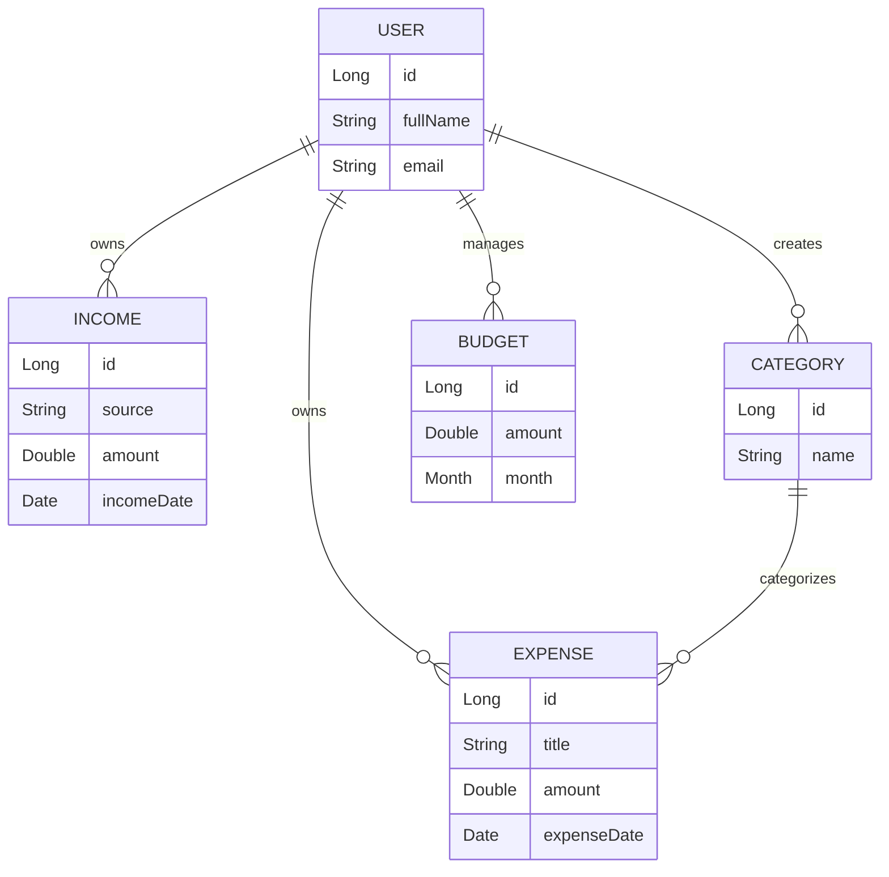

# Expense Tracker Database ER Diagram

```mermaid
erDiagram

    USER ||--o{ EXPENSE : owns
    USER ||--o{ INCOME : owns
    USER ||--o{ CATEGORY : creates
    USER ||--o{ BUDGET : manages

    CATEGORY ||--o{ EXPENSE : categorizes

    USER {
        Long id
        String fullName
        String email
    }

    EXPENSE {
        Long id
        String title
        Double amount
        Date expenseDate
    }

    INCOME {
        Long id
        String source
        Double amount
        Date incomeDate
    }

    CATEGORY {
        Long id
        String name
    }

    BUDGET {
        Long id
        Double amount
        Month month
    }
```